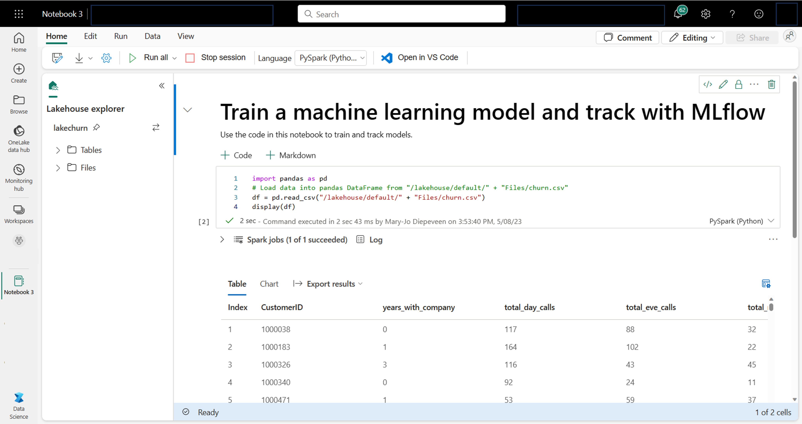
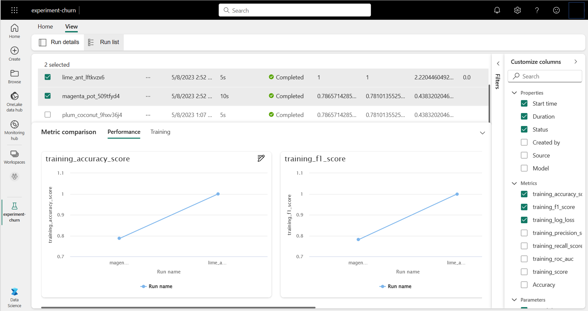
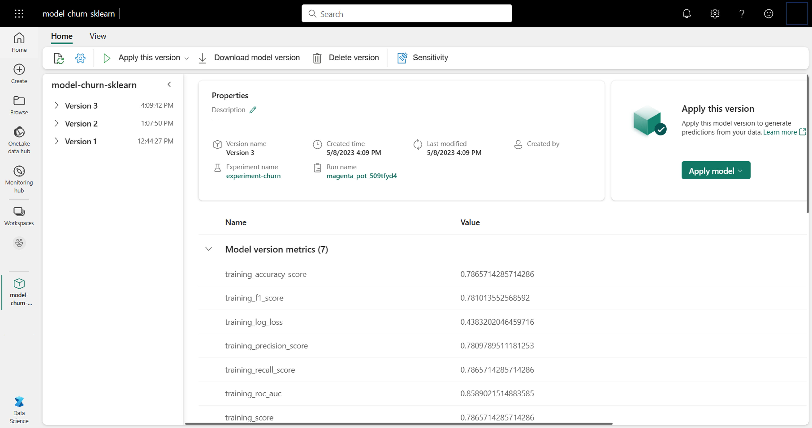

# Get started with data science in Microsoft Fabric

- In Microsoft Fabric, data scientists can manage data, notebooks, experiments, and models while easily accessing data from across the organization and collaborating with their fellow data professionals.

## Introduction

- Imagine you're working for a supermarket and you want to know how much bread you need to have in stock every week to meet customer demands while also avoiding food waste.

- Or maybe you want to analyze your customers to understand how to best target them with personalized offers.

- Whenever you want to make informed decisions within an organization, you can use data science to get insights from the data you have.

- When you perform data science, you can analyze your data and identify complicated patterns that can provide you with meaningful insights for your organization. You can use data science to create artificial intelligence (AI) models that encompass the complicated patterns you find in your data. A common approach is to use data science to train machine learning models using libraries like scikit-learn in Python to achieve AI.

- Taking a data science project from beginning to end can be a challenge. Microsoft Fabric offers one workspace to manage an end-to-end data science project.

## Explore and process data with Microsoft Fabric

- Data is the cornerstone of data science, particularly when aiming to train a machine learning model for achieving artificial intelligence. Typically, models exhibit enhanced performance as the training dataset size increases. In addition to the quantity of data, the quality of the data is equally crucial.

- To guarantee both the quality and quantity of your data, using Microsoft Fabric's robust data ingestion and processing engines is worthwhile. You have the flexibility to opt for either a low-code or code-first approach when establishing the essential data ingestion, exploration, and transformation pipelines.

### Ingest your data into Microsoft Fabric

- To work with data in Microsoft Fabric, you first need to ingest data. You can ingest data from multiple sources, both local and cloud data sources. For example, you can ingest data from a CSV file stored on your local machine or in an Azure Data Lake Storage (Gen2).

- After connecting to a data source, you can save the data into a Microsoft Fabric lakehouse. You can use the lakehouse as a central location to store any structured, semi-structured, and unstructured files. You can then easily connect to the lakehouse whenever you want to access your data for exploration or transformation.

### Explore and transform your data

- Microsoft Fabric offers a familiar notebook experience, powered by Spark compute. Apache Spark is an open source parallel processing framework for large-scale data processing and analytics.

- Notebooks are automatically attached to Spark compute. When you run a cell in a notebook for the first time, a new Spark session starts. The session persists when you run subsequent cells. The Spark session will automatically stop after some time of inactivity to save costs. You can also manually stop the session.

- When you're working in a notebook, you can choose the language you want to use. For data science workloads, you're likely to work with PySpark (Python) or SparkR (R).

- Within the notebook, you can explore your data using your preferred library, or with any of the built-in visualization options. If necessary, you can transform your data and save the processed data by writing it back to the lakehouse.

### Prepare your data with the Data Wrangler

- After launching the Data Wrangler, you'll get a descriptive overview of the data you're working with. You can view the summary statistics of your data to find any issues like missing values.

- To clean your data, you can choose any of the built-in data-cleaning operations. When you select an operation, a preview of the result and the associated code is automatically generated for you. When you have selected all necessary operations, you can export the transformations to code and execute it on your data.

## Train and score models with Microsoft Fabric

- When you've ingested, explored, and preprocessed your data, you can use the data to train a model. Training a model is an iterative process, and you want to be able to track your work.

- Microsoft Fabric integrates with MLflow to easily track and log your work, enabling you to review your work at any time to decide what the best approach is to train the final model. When you track your work, your results are easily reproducible.

- Any work you want to track, can be tracked as experiments.

### Understand experiments

- Whenever you train a model in a notebook that you want to track, you create an experiment in Microsoft Fabric.

- An experiment can consist of multiple runs. Each run represents a task you executed in a notebook, like training a machine learning model.

- For example, to train a machine learning model for sales forecasting, you can try different training datasets with the same algorithm. Each time you train a model with a different dataset, you create a new experiment run. Then, you can compare the experiment runs to determine the best performing model.

### Start Tracking metrics

- To compare experiment runs, you can track parameters, metrics, and artifacts for each run.

- All parameters, metrics, and artifacts you track in an experiment run are shown in the experiments overview. You can view experiment runs individually in the Run details tab, or compare across runs with the Run list.

- By tracking your work with MLflow, you can compare model training iterations and decide which configuration resulted in the best model for your use case.

### Understand models

- After you train a model, you want to use it for scoring. With scoring, you use the model on new data to generate predictions or insights. When you train and track a model with MLflow, artifacts are stored within the experiment run to represent your model and its metadata. You can save these artifacts in Microsoft Fabric as a model.

- By saving your model artifacts as a registered model in Microsoft Fabric, you can easily manage your models. Anytime you train a new model and save it under the same name, you add a new version to the model.

### Use a model to generate insights

- To use a model for generating predictions, you can use the PREDICT function in Microsoft Fabric. The PREDICT function is built to easily integrate with MLflow models and allows you to use the model for generating batch predictions.

- For example, every week you receive sales data from several stores. Based on the historical data, you've trained a model that can predict the sales for the next week, based on the sales of the last few weeks. You tracked the model with MLflow and saved it in Microsoft Fabric. Whenever the new weekly sales data comes in, you use the PREDICT function to let the model generate the forecast for the next week. The forecasted sales data is stored as a table in a lakehouse, which is visualized in a Power BI report for business users to consume.

